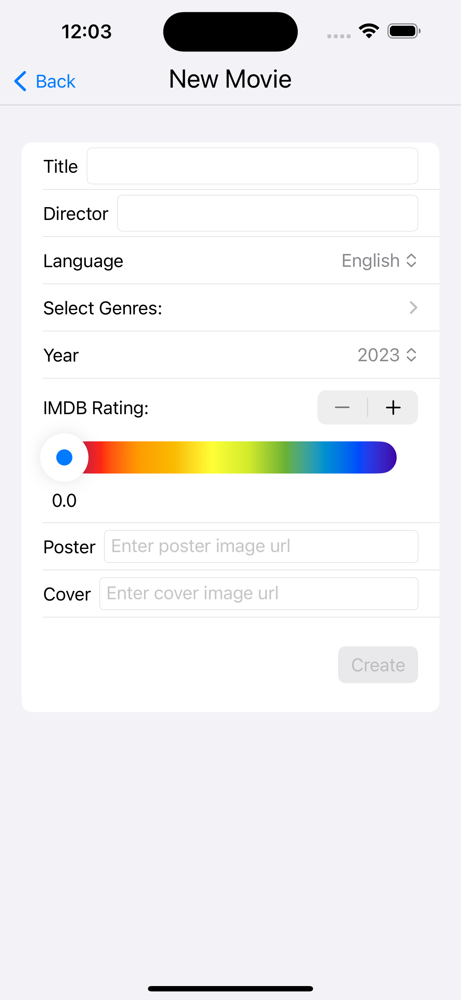

## Movie Archive
**`Movie Archive`** is an iOS application designed to be your one-stop shop for managing your personal movie collection. Keep track of the films you own, discover new favorites, and organize your cinematic library with ease.

     

### Getting Started

#### Prerequisites
- Xcode 15.0 or later
- iOS 17.0 or later

#### Installation
1. Clone the repository :
``` bash
git clone https://github.com/Asad51/Movie-Archive.git
```
2. Open the project in Xcode.
3. Build and run the app on the iOS simulator
4. To run on a real device, you will need to locally modify the signing options:
    - Click on `Movie Archive` at the top of the left sidebar
    - Click on the `Signing & Capabilities` tab
    - Under `Targets`, select `Movie Archive`
    - In the `Team` dropdown, select your name. If your name doesn't appear, you may need to sign into Xcode with your Apple developer account.
    - Change the `Bundle Identifier` to something different. You can add your name or some random letters to make it unique.
    - Now you can select your Apple device in the top bar as a target and click the Play button to run.

#### Issues
If you encounter any issues or have suggestions for improvement, please [open an issue](https://github.com/Asad51/Movie-Archive/issues).